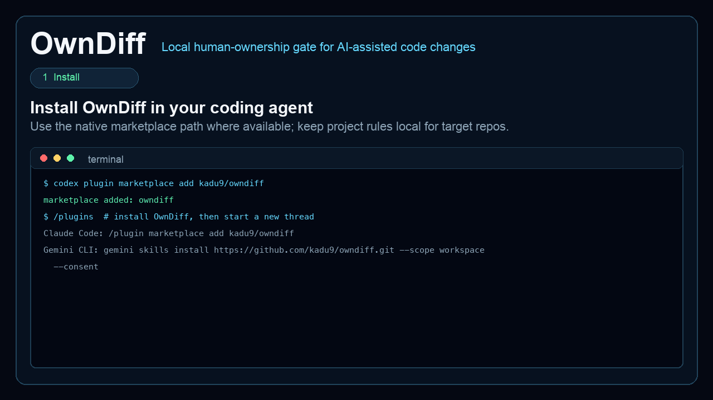

# Own Your Diff

**Human ownership gate for AI coding-agent diffs**

[](https://github.com/owndiff/own-your-diff/actions/workflows/ci.yml)
[](https://www.python.org/)
[](LICENSE)
[](#codex--openai)
[](#claude-code)
[](#gemini-cli)


OwnDiff is a local Agent Skill that makes a human prove they understand risky AI-assisted code changes before an agent pushes or opens a merge request.

It analyzes the current git diff, scores risky areas, detects test gaps, and asks the active coding agent's LLM/API to generate easy, diff-grounded MCQs for medium/high/critical risk. Low-risk changes are report-only. OwnDiff never uses web search or deterministic fallback questions.

## Why OwnDiff

AI coding agents can produce a working diff faster than a developer can inspect its behavior, failure modes, test coverage, and rollback path. A passing test suite does not prove that the assigned human understands the change.

OwnDiff adds a local human-in-the-loop checkpoint. It does not write another code review. It asks simple questions about the actual diff and keeps the push/merge-request permission false until the human answers every question correctly.

## How It Works

1. Collect the current git diff without executing target repository code.
2. Score changed paths, risk domains, diff size, secret-like additions, and nearby test signals.
3. For medium/high/critical risk, write a sanitized prompt for the active coding agent's LLM/API.
4. Validate the returned MCQs against changed files and diff facts, then open the keyboard and mouse TUI.
5. Record attempts and set `agent_may_push_merge_request` to `true` only after a perfect submission.

Low-risk changes skip the quiz and remain report-only.

## Quick Start

Use your agent's native install path when possible.

### Claude Code

```text
/plugin marketplace add owndiff/own-your-diff
/plugin install owndiff@owndiff
/reload-plugins
```

Send the marketplace add and plugin install as separate Claude Code prompts.

### Codex / OpenAI

```bash
codex plugin marketplace add owndiff/own-your-diff
codex plugin add owndiff@owndiff
```

Start a new Codex thread after installation.

### Gemini CLI

```bash
gemini skills install https://github.com/owndiff/own-your-diff.git --consent
```

### Fallback: Project Rules

Use this only for OpenCode, Pi, Hermes, Devin, private repos, or when you want the gate written into the target project:

```bash
git clone https://github.com/owndiff/own-your-diff.git .owndiff-skill
python3 -m venv .owndiff-skill/.venv && .owndiff-skill/.venv/bin/python -m pip install -e .owndiff-skill
.owndiff-skill/.venv/bin/python .owndiff-skill/scripts/install_agent_rules.py --repo . --agents all --verify --python-command .owndiff-skill/.venv/bin/python
```

For private forks, GitHub-based installs need credentials that can clone the fork.

## Use

Ask your coding agent:

```text
Run OwnDiff before pushing this change.
```

The agent analyzes the diff. For medium/high/critical risk, it uses its current LLM/API context to generate every question and answer choice from sanitized local diff facts, validates the result, and opens the terminal picker. Use arrow keys or mouse clicks, press `Enter`, review all answers, then choose **Submit gate** or **Cancel**.

Normal users never type answers such as `q1=a`. If the agent has no interactive TTY, it should print the exact `quiz_tui.py --evaluate` command for you to run in a real terminal.

The agent may push or open/update a merge request only when `.owndiff/ownership-gate.json` contains:

```json
{"agent_may_push_merge_request": true}
```

The same gate records `attempts`, `attempts_to_pass`, and `attempt_summary`, for example `Passed after 2 attempts.`.

Add generated artifacts to the target repo's ignore file:

```gitignore
.owndiff/
```

## TUI Demo

End-to-end replay against a local clone of [`openclaw/openclaw`](https://github.com/openclaw/openclaw): install the skill, let the active agent/model generate validated MCQs from the diff prompt, answer MCQs in the terminal picker, pass the gate, then allow the agent to push or open a merge request.



The setup and final gate frames are context slides. The quiz and review frames show the same terminal picker flow used by `scripts/quiz_tui.py`.

Keys: arrow keys or `j`/`k` to move through options, `Enter` to select, review all answers, then use arrow keys and `Enter` on **Submit gate**, **Edit answers**, or **Cancel**. Letter shortcuts and mouse clicks also work when the terminal supports them.

Exit codes: `0` passed, `2` setup/no-TTY fallback, `3` failed answers, `130` canceled.

## OpenClaw Example

The demo uses a local throwaway diff against the public OpenClaw repository. It adds `packages/web-content-core/src/auth/session-token-guard.ts` and extracts `hasUsableSessionToken` in `provider-runtime-shared.ts`.

Observed analysis:

```json
{
  "files_changed": 2,
  "risk_level": "high",
  "risk_score": 68,
  "test_gap": true,
  "question_generation": "agent_llm",
  "questions": 5,
  "gate_status": "pending_answers",
  "agent_may_push_merge_request": false
}
```

One generated easy question was:

> What behavior does `session-token-guard.ts` add to the auth flow?

The correct choice explained that the guard blocks missing or reused tokens and allows a usable token that was not previously used. The TUI kept the gate blocked after an incorrect first submission and recorded this final result:

```json
{
  "status": "passed",
  "score_percent": 100,
  "attempts_to_pass": 2,
  "attempt_summary": "Passed after 2 attempts.",
  "agent_may_push_merge_request": true
}
```

These are observed local results, not a benchmark or an OpenClaw endorsement. The demo diff is not part of OpenClaw.

## Fallback Project Files

| Agent | Files |
| --- | --- |
| Claude Code | `CLAUDE.md`, `.claude/skills/owndiff` |
| Codex / OpenAI | `AGENTS.md`, `.agents/skills/owndiff` |
| OpenCode | `AGENTS.md`, `.agents/skills/owndiff` |
| Gemini CLI | `GEMINI.md`, `.agents/skills/owndiff` |
| Pi | `AGENTS.md`, `.agents/skills/owndiff` |
| Hermes | `AGENTS.md` |
| Devin | `.devin/rules/owndiff.md` |

The project-rule installer is configuration-driven through [configs/agent_install.yaml](configs/agent_install.yaml).

## Verification Status

| Surface | Verified here |
| --- | --- |
| Codex/OpenAI | Plugin manifest and skill discovery in Codex |
| Claude Code | Marketplace/plugin manifest structure and project-rule installation |
| Gemini CLI | Skill URL command syntax and project-rule installation |
| OpenCode, Pi, Hermes, Devin | Generated project-rule files and local OwnDiff command availability |
| OpenClaw | Real repository diff analysis, active-agent MCQ validation, keyboard TUI, failed attempt, and passed gate |

Project-rule verification confirms generated files, skill links, and local command availability. It does not claim that every external agent runtime was launched in this environment.

## Configuration

OwnDiff loads [configs/default_config.yaml](configs/default_config.yaml), then deep-merges `.owndiff.yml`, `.owndiff.yaml`, or `.owndiff.json` from the target repo. Use `--config path/to/config.yaml` for an explicit override.

Common extensions: file extensions, test path patterns, risk domains, risk thresholds, gate modes, question planning, and MCQ behavior. By default, MCQs are only generated for `medium`, `high`, and `critical` risk. Start from [configs/example_override.yaml](configs/example_override.yaml).

Question generation always uses the active coding agent's current LLM/API context:

```yaml
questions:
  llm:
    enabled: true
    provider: agent
```

The prompt tells the model not to use web search, package registries, issue trackers, or outside facts. OwnDiff validates easy difficulty, four distinct answer choices, changed-file/risk-domain grounding, JSON shape, and unknown paths. Invalid, repeated, or hallucinated output blocks question generation.

## Security

- OwnDiff does not execute target repository code.
- OwnDiff's Python scripts contain no network client and do not upload artifacts.
- The active coding agent processes the sanitized question prompt under that agent provider's existing data and privacy policy.
- `.owndiff/` artifacts are local and should stay ignored.
- The local answer key is review evidence, not a cryptographic secret.
- For production enforcement, add a CI or GitHub/GitLab check that reruns evaluation server-side.

## Threat Model and Limits

- OwnDiff is a local ownership checkpoint, not a security scanner or cryptographic attestation.
- A user or agent with write access can edit local `.owndiff/` artifacts. Treat the gate as evidence unless a trusted CI job enforces it.
- Risk scoring is configurable and heuristic; it can miss project-specific risk without suitable configuration.
- LLM output is rejected when it is malformed, repetitive, or not grounded in the supplied diff facts, but human review is still required.
- Passing OwnDiff does not replace tests, code review, branch protection, or deployment controls.

## FAQ

### Does OwnDiff call its own LLM service?

No. The skill asks the active coding agent's existing LLM/API context to answer the local question prompt.

### Does question generation use the web?

No. The prompt forbids web search and outside facts. Questions must be grounded in the sanitized diff facts supplied by OwnDiff.

### When does the quiz appear?

By default, medium, high, and critical changes require MCQs. Low-risk changes are report-only.

### Does OwnDiff push code?

No. It writes a local gate decision. The coding agent may push or open/update a merge request only after the gate passes and normal repository checks also allow it.

### Can I answer without typing `q1=a`?

Yes. The normal flow is the interactive terminal picker with arrows, `Enter`, mouse support, review, submit, edit, and cancel actions. A non-TTY agent should print the exact command for opening that picker in a real terminal.

## Development

```bash
python -m pip install pytest ruff pylint
pytest
ruff check .
pylint --errors-only $(git ls-files '*.py')
```
