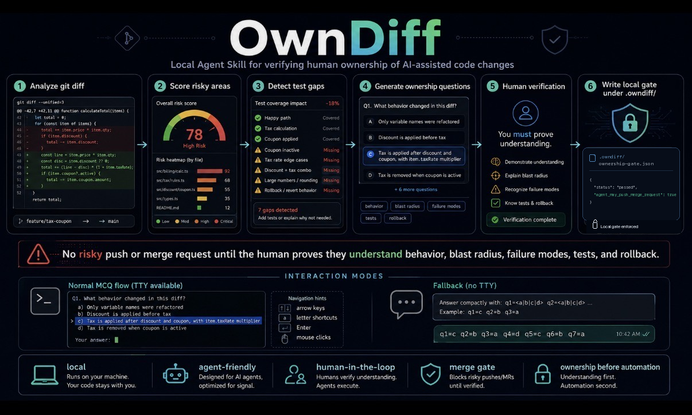

# OwnDiff

[](https://github.com/owndiff/own-your-diff/actions/workflows/ci.yml)
[](https://www.python.org/)
[](LICENSE)



OwnDiff is a local Agent Skill that makes a human prove they understand risky AI-assisted code changes before an agent pushes or opens a merge request.

It analyzes the current git diff, scores risky areas, detects test gaps, generates MCQ ownership questions, and writes a local gate under `.owndiff/`. The answer key, answers, reports, and gate stay on your machine.

## Install

Use your agent's native install path when possible.

### Claude Code

```text
/plugin marketplace add owndiff/own-your-diff
/plugin install owndiff@owndiff
/reload-plugins
```

Send the marketplace add and plugin install as separate Claude Code prompts.

### Codex / OpenAI

```bash
codex plugin marketplace add owndiff/own-your-diff
codex
```

Open `/plugins`, choose the OwnDiff marketplace, install OwnDiff, then start a new thread.

### Gemini CLI

```bash
gemini skills install https://github.com/owndiff/own-your-diff.git --scope workspace --consent
```

### Fallback: Project Rules

Use this only for OpenCode, Pi, Hermes, Devin, private repos, or when you want the gate written into the target project:

```bash
git clone https://github.com/owndiff/own-your-diff.git .owndiff-skill
python3 -m venv .owndiff-skill/.venv && .owndiff-skill/.venv/bin/python -m pip install -e .owndiff-skill
.owndiff-skill/.venv/bin/python .owndiff-skill/scripts/install_agent_rules.py --repo . --agents all --verify --python-command .owndiff-skill/.venv/bin/python
```

For private forks, GitHub-based installs need credentials that can clone the fork.

## Use

Before an agent pushes or opens/updates a merge request, it should run OwnDiff on the target repo:

```bash
.owndiff-skill/.venv/bin/python .owndiff-skill/scripts/run_owndiff.py --repo . --out-dir .owndiff
```

If the gate is blocked, answer the MCQs in the terminal picker:

```bash
.owndiff-skill/.venv/bin/python .owndiff-skill/scripts/quiz_tui.py --evaluate
```

No TTY? Have the agent show questions in chat and submit compact answers:

```bash
.owndiff-skill/.venv/bin/python .owndiff-skill/scripts/present_mcq.py
.owndiff-skill/.venv/bin/python .owndiff-skill/scripts/submit_answers.py --evaluate q1=c q2=b q3=a
```

The agent may push or open/update a merge request only when `.owndiff/ownership-gate.json` contains:

```json
{"agent_may_push_merge_request": true}
```

Add generated artifacts to the target repo's ignore file:

```gitignore
.owndiff/
```

## TUI Demo

End-to-end demo using a local OpenClaw test repo: install rules, analyze the diff, answer MCQs, pass the gate, then allow the agent to push or open a merge request.


The quiz and review frames in this GIF are rendered from the same curses layout used by `scripts/quiz_tui.py`.

Keys: arrow keys or `j`/`k` to move, `a`/`b`/`c`/`d` to answer, `Enter` to select, `s` to submit, `q` or `Esc` to cancel. Mouse clicks work when the terminal forwards mouse events.

Exit codes: `0` passed, `2` setup/no-TTY fallback, `3` failed answers, `130` canceled.

## Installed Project Files

| Agent | Files |
| --- | --- |
| Claude Code | `CLAUDE.md`, `.claude/skills/owndiff` |
| Codex / OpenAI | `AGENTS.md`, `.agents/skills/owndiff` |
| OpenCode | `AGENTS.md`, `.agents/skills/owndiff` |
| Gemini CLI | `GEMINI.md`, `.agents/skills/owndiff` |
| Pi | `AGENTS.md`, `.agents/skills/owndiff` |
| Hermes | `AGENTS.md` |
| Devin | `.devin/rules/owndiff.md` |

The project-rule installer is configuration-driven through [configs/agent_install.yaml](configs/agent_install.yaml).

## Configuration

OwnDiff loads [configs/default_config.yaml](configs/default_config.yaml), then deep-merges `.owndiff.yml`, `.owndiff.yaml`, or `.owndiff.json` from the target repo. Use `--config path/to/config.yaml` for an explicit override.

Common extensions: file extensions, test path patterns, risk domains, risk thresholds, gate modes, ownership questions, and MCQ behavior. Start from [configs/example_override.yaml](configs/example_override.yaml).

## Security

- OwnDiff does not execute target repository code.
- OwnDiff does not upload source, patches, reports, answers, or answer keys.
- `.owndiff/` artifacts are local and should stay ignored.
- The local answer key is review evidence, not a cryptographic secret.
- For production enforcement, add a CI or GitHub/GitLab check that reruns evaluation server-side.

## Development

```bash
python -m pip install pytest ruff pylint
pytest
ruff check .
pylint --errors-only $(git ls-files '*.py')
```
