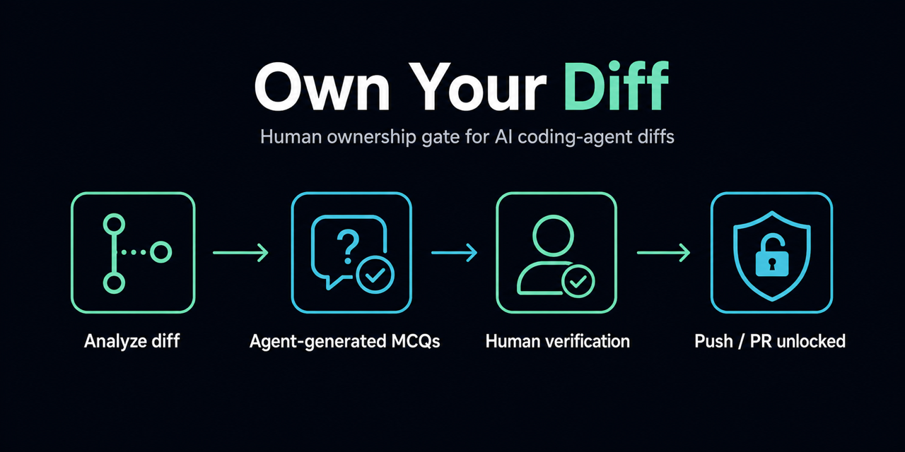
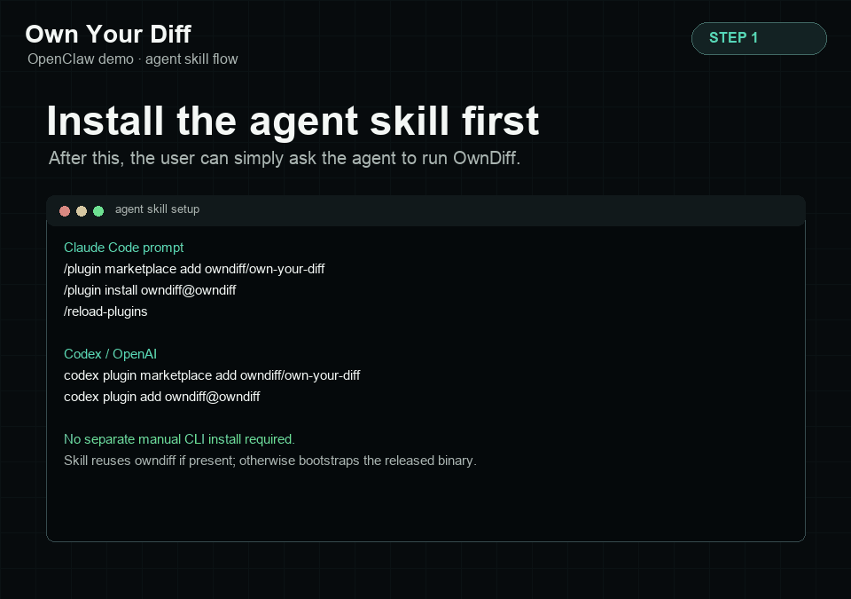

# Own Your Diff

**Human ownership gate for AI coding-agent diffs**

[](https://github.com/owndiff/own-your-diff/actions/workflows/ci.yml)
[](#install-the-cli)
[](#build-and-release-binaries)
[](LICENSE)
[](#codex--openai)
[](#claude-code)
[](#gemini-cli)



OwnDiff is a local Agent Skill that makes a human prove they understand risky AI-assisted source-code changes before an agent pushes or opens a merge request.

It analyzes the current git diff, scores risky areas, detects test gaps, and asks the active coding agent's LLM/API to generate easy, diff-grounded MCQs for medium/high/critical source-code risk. Documentation and other non-source-only changes produce a report but no MCQ or gate artifacts. OwnDiff never uses web search or deterministic fallback questions.

## Why OwnDiff

AI coding agents can produce a working diff faster than a developer can inspect its behavior, failure modes, test coverage, and rollback path. A passing test suite does not prove that the assigned human understands the change.

OwnDiff adds a local human-in-the-loop checkpoint. It does not write another code review. It asks simple questions about the actual diff and keeps the push/merge-request permission false until the human answers every question correctly.

## How It Works

1. Collect the current git diff and classify source files from configured extensions without executing target repository code.
2. Score changed paths, risk domains, diff size, secret-like additions, and nearby test signals.
3. For medium/high/critical source-code risk, write a sanitized source-only prompt for the active coding agent's LLM/API.
4. Validate the returned MCQs against changed files and diff facts, then open a localhost browser review.
5. Record attempts and set `agent_may_push_merge_request` to `true` only after a perfect submission.

Documentation, Markdown, text, and other non-source-only changes skip MCQ and gate generation. Low-risk source changes keep a report-only gate.

## Quick Start

### Install the CLI

OwnDiff installs as a single local executable. The installer detects macOS or Linux and the current CPU architecture, downloads the matching release asset, and places `owndiff` on your `PATH`. No Python, shell bootstrap, or virtual environment is required for normal use.

```bash
curl -fsSL https://raw.githubusercontent.com/owndiff/own-your-diff/main/install.sh | sh
owndiff --version
```

The release workflow publishes these assets:

- `owndiff-darwin-arm64`
- `owndiff-darwin-x86_64`
- `owndiff-linux-arm64`
- `owndiff-linux-x86_64`

To install somewhere other than `/usr/local/bin`, use:

```bash
curl -fsSL https://raw.githubusercontent.com/owndiff/own-your-diff/main/install.sh | OWNDIFF_BIN_DIR="$HOME/.local/bin" sh
```

If the latest-release link returns `404`, publish the first binary release with [Build and Release Binaries](#build-and-release-binaries).

### Run the Gate

From the repository being changed:

```bash
owndiff run --repo . --out-dir .owndiff
```

Ask your coding agent:

```text
Run OwnDiff before pushing this change.
```

OwnDiff analyzes the diff. For medium/high/critical source-code risk, the active coding agent uses its own LLM/API context to answer OwnDiff's local prompt, then OwnDiff validates those MCQs and opens a browser ownership review by default.

Each `owndiff run` starts a fresh local review for the current diff. Previous MCQs, answers, answer keys, gates, prompts, reports, and stale LLM response files are cleared before the new run writes current artifacts. If you intentionally pass `--llm-response`, that exact response file is preserved only long enough for the current validation run.

OwnDiff starts a localhost review server and opens your default browser so you can click answers. Hints are shown by default and can be hidden from the review page; **Retry quiz** clears current selections before submission. If the browser cannot be opened automatically, the command prints the local URL and keeps waiting for submission. After submission, the browser review attempts to close itself, the command exits back to the same terminal session, and on macOS it makes a best-effort attempt to refocus known terminal apps.

For source-code changes, an agent may push or open/update a merge request only when `.owndiff/ownership-gate.json` contains:

```json
{"agent_may_push_merge_request": true}
```

The same gate records `attempts`, `attempts_to_pass`, and `attempt_summary`, for example `Passed after 2 attempts.`. When no configured source-code extension changed, OwnDiff returns `gate_status: not_required_no_source_changes` and does not write MCQ, answer-key, answer, or gate artifacts.

Add generated artifacts to the target repo's ignore file:

```gitignore
.owndiff/
```

## Agent Setup

The CLI is enough for local use. For durable agent behavior, add OwnDiff to the coding agent or project rules so the agent knows it must run the gate before pushing or opening a merge request.

If an agent does not open browser review for pending MCQs, it is using an old cached OwnDiff install. Update/reload the plugin or reinstall the CLI; current OwnDiff uses localhost browser review only.

### Claude Code

```text
/plugin marketplace add owndiff/own-your-diff
/plugin install owndiff@owndiff
/reload-plugins
```

Send the marketplace add and plugin install as separate Claude Code prompts.

### Codex / OpenAI

```bash
codex plugin marketplace add owndiff/own-your-diff
codex plugin add owndiff@owndiff
```

Start a new Codex thread after installation.

### Gemini CLI

```bash
gemini skills install https://github.com/owndiff/own-your-diff.git --consent
```

### Project Rules

Use this for OpenCode, Pi, Hermes, Devin, private repos, or when you want OwnDiff rules written into a target project. Install the `owndiff` CLI first, then run:

```bash
owndiff install-agent-rules --repo /path/to/target/repo --agents all --verify
```

The installer is configuration-driven through [configs/agent_install.yaml](configs/agent_install.yaml). When run from the standalone executable, it writes durable project rules that call `owndiff` and skips source-checkout skill symlinks.

## Browser Review Demo

End-to-end replay against a local clone of [`openclaw/openclaw`](https://github.com/openclaw/openclaw): install the skill, let the active agent/model generate validated MCQs from the diff prompt, answer MCQs in the localhost browser review, pass the gate, then allow the agent to push or open a merge request.



The browser review binds only to localhost, keeps the answer key server-side, and submits to the same local gate artifacts. The agent remains blocked until every answer is correct.

Interactive exit codes: `0` passed or report-only, `2` setup/browser-review timeout, `3` failed answers, `130` canceled.

## OpenClaw Example

The demo uses a local throwaway diff against the public OpenClaw repository. It adds `packages/web-content-core/src/auth/session-token-guard.ts` and extracts `hasUsableSessionToken` in `provider-runtime-shared.ts`.

Observed analysis:

```json
{
  "files_changed": 2,
  "risk_level": "high",
  "risk_score": 68,
  "test_gap": true,
  "question_generation": "agent_llm",
  "questions": 5,
  "gate_status": "pending_answers",
  "agent_may_push_merge_request": false
}
```

One generated easy question was:

> What behavior does `session-token-guard.ts` add to the auth flow?

The correct choice explained that the guard blocks missing or reused tokens and allows a usable token that was not previously used. The browser review kept the gate blocked after an incorrect first submission and recorded this final result:

```json
{
  "status": "passed",
  "score_percent": 100,
  "attempts_to_pass": 2,
  "attempt_summary": "Passed after 2 attempts.",
  "agent_may_push_merge_request": true
}
```

These are observed local results, not a benchmark or an OpenClaw endorsement. The demo diff is not part of OpenClaw.

## Fallback Project Files

| Agent | Files |
| --- | --- |
| Claude Code | `CLAUDE.md`, `.claude/skills/owndiff` |
| Codex / OpenAI | `AGENTS.md`, `.agents/skills/owndiff` |
| OpenCode | `AGENTS.md`, `.agents/skills/owndiff` |
| Gemini CLI | `GEMINI.md`, `.agents/skills/owndiff` |
| Pi | `AGENTS.md`, `.agents/skills/owndiff` |
| Hermes | `AGENTS.md` |
| Devin | `.devin/rules/owndiff.md` |

The project-rule installer is configuration-driven through [configs/agent_install.yaml](configs/agent_install.yaml) and verifies the exact `--owndiff-command` written into those rules.

## Configuration

OwnDiff loads [configs/default_config.yaml](configs/default_config.yaml), then deep-merges `.owndiff.yml`, `.owndiff.yaml`, or `.owndiff.json` from the target repo. Use `--config path/to/config.yaml` for an explicit override.

Common extensions: source-code extensions, language mappings, test path patterns, risk domains, risk thresholds, gate modes, question planning, and MCQ behavior. Add a language under `diff.language_extensions` and mark its extension `true` under `diff.source_extensions` to make it eligible for ownership gating. By default, MCQs are only generated for `medium`, `high`, and `critical` source-code risk, with five questions per gated run. Start from [configs/example_override.yaml](configs/example_override.yaml).

Question generation always uses the active coding agent's current LLM/API context:

```yaml
questions:
  question_counts:
    medium: 5
    high: 5
    critical: 5
  llm:
    enabled: true
    provider: agent
```

Use `owndiff run --question-count 4` to override the question count for one executable run without editing config.

The prompt tells the model not to use web search, package registries, issue trackers, or outside facts. OwnDiff validates easy difficulty, four distinct answer choices, question-specific hints, changed-file/risk-domain grounding, JSON shape, and unknown paths. Invalid, repeated, generic, or hallucinated output blocks question generation.

## Security

- OwnDiff does not execute target repository code.
- OwnDiff's analysis code contains no network client and does not upload artifacts.
- The active coding agent processes the sanitized question prompt under that agent provider's existing data and privacy policy.
- `.owndiff/` artifacts are local and should stay ignored.
- The local answer key is review evidence, not a cryptographic secret.
- For production enforcement, add a CI or GitHub/GitLab check that reruns evaluation server-side.

## Threat Model and Limits

- OwnDiff is a local ownership checkpoint, not a security scanner or cryptographic attestation.
- A user or agent with write access can edit local `.owndiff/` artifacts. Treat the gate as evidence unless a trusted CI job enforces it.
- Risk scoring is configurable and heuristic; it can miss project-specific risk without suitable configuration.
- LLM output is rejected when it is malformed, repetitive, or not grounded in the supplied diff facts, but human review is still required.
- Passing OwnDiff does not replace tests, code review, branch protection, or deployment controls.

## FAQ

### Does OwnDiff call its own LLM service?

No. The skill asks the active coding agent's existing LLM/API context to answer the local question prompt.

### Does question generation use the web?

No. The prompt forbids web search and outside facts. Questions must be grounded in the sanitized diff facts supplied by OwnDiff.

### When does the quiz appear?

By default, medium, high, and critical source-code changes require MCQs. Low-risk source changes are report-only. Documentation and other non-source-only changes do not generate MCQ or gate artifacts.

### Does OwnDiff push code?

No. It writes a local gate decision. The coding agent may push or open/update a merge request only after the gate passes and normal repository checks also allow it.

### How do I answer MCQs?

Use `owndiff run --repo . --out-dir .owndiff`. When questions are pending, it opens a localhost browser review in your default browser so you can use hints, click answers, retry before submitting, and submit the gate there.

## Build and Release Binaries

Normal users install the released executable. Maintainers build release assets with PyInstaller through GitHub Actions; PyInstaller is not a cross-compiler, so each asset is built on its target operating system and CPU architecture.

```bash
python3.11 -m venv .venv
. .venv/bin/activate
python -m pip install --upgrade pip
python -m pip install -e '.[build]'
python scripts/build_binary.py --name owndiff
./dist/owndiff --version
```

The release workflow builds:

- `owndiff-darwin-arm64` on `macos-26`
- `owndiff-darwin-x86_64` on `macos-26-intel`
- `owndiff-linux-arm64` on `ubuntu-24.04-arm`
- `owndiff-linux-x86_64` on `ubuntu-latest`

Run it manually from GitHub Actions to collect artifacts, or push a version tag such as `v0.2.0` to publish those binaries to GitHub Releases.

Before any CI or release binary is created, GitHub Actions runs `scripts/ci_openclaw_flow.py` against a pinned OpenClaw checkout. That flow applies the documented throwaway auth/session diff, verifies OwnDiff asks for an agent LLM response, validates five MCQs, submits the localhost review, and requires the gate to pass.

CI also builds a Linux executable, installs it through `install.sh` using a local file URL, and smoke-tests `owndiff --version`, `owndiff run --help`, `owndiff install-agent-rules --help`, and `owndiff quiz-web --help`. The release workflow repeats the same install harness for each published macOS and Linux asset.

## Development

```bash
python -m pip install -e . pytest ruff pylint
pytest
ruff check .
pylint --errors-only $(git ls-files '*.py')
```
